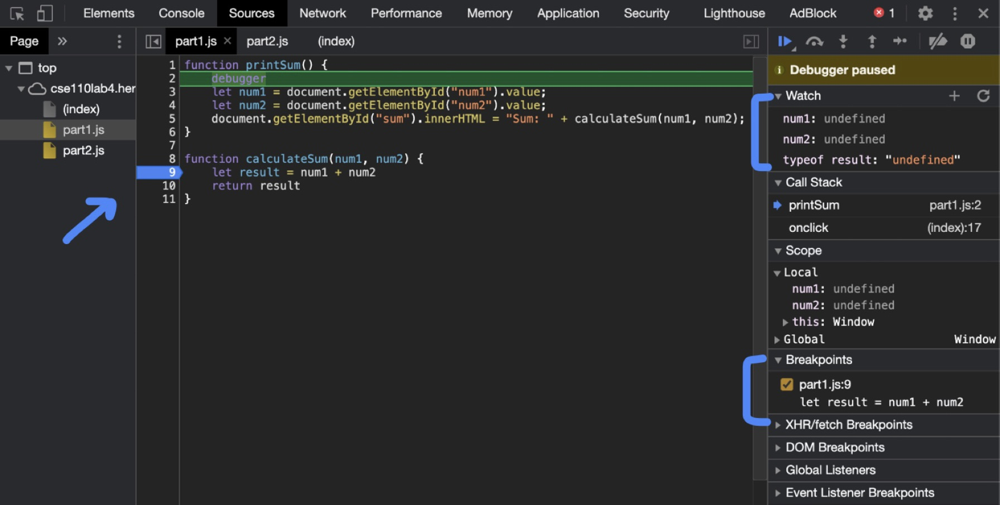
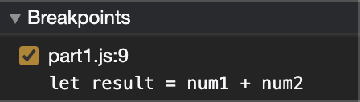
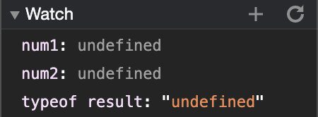
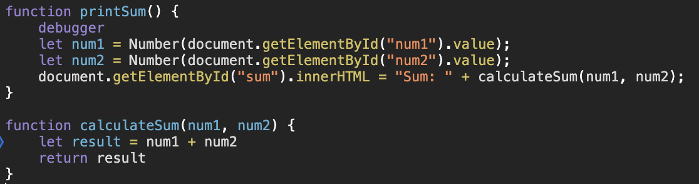
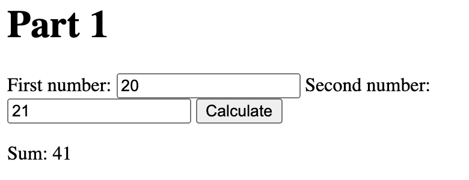

# DevTools - Debugging

#### Screenshot

#### Breakpoint List  Screenshot

#### Watch Expressions List Screenshot

#### What was the bug?
The bug was that when the num1 and num2 were being retrieved by the <code>document.getElementbyId()</code> snippet, thet were being converted to strings. Therefore, when they went into the other function <code>calculateSum</code> to be added together, they were instead being concatenated because they were both of string type. So the <code>result</code> would just be a string of the first number concatenated with the second instead of their sum.

#### How would you fix it?
In order to fix this issue, an explicit type cast to <code>Number</code> to when the variables are retrieved would solve the issue. Now they are taken in as Numbers so that when they enter the next function, it will simply be the addition of two Numbers which results in the actual sum and the data type of <code>result</code> would now be <code>Number</code>.

#### Screenshot of fixed file

# DevTools - Network Tab
1. Name of the new json file --- citylots.json
2. File that initiated the download --- part2.js
3. File size --- 11.7 MB
4. Time --- 1.47s
5. User Agent --- Mozilla/5.0 (Macintosh; Intel Mac OS X 10_15_7) AppleWebKit/537.36 (KHTML, like Gecko) Chrome/87.0.4280.141 Safari/537.36
6. Server --- Apache
7. Last Modified --- Tue, 26 Jan 2021 22:14:13 GMT
8. Content Type --- application/json
9. Method inside file that made the request --- fetchData()

